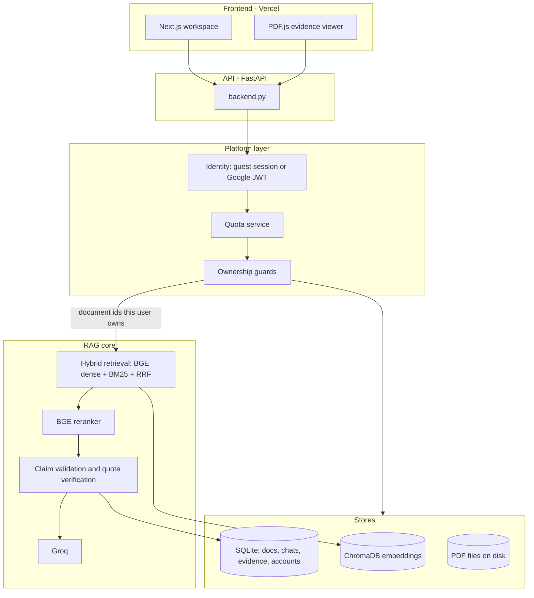

# DocuSage

An evidence-grounded PDF research assistant. Ask a question about your
documents and every important claim in the answer carries a citation you can
click — which opens the source PDF and highlights the exact sentence the claim
came from.

**Beta — free for students.** No card, no paid tier.

<!-- Replace with your own links once deployed. -->
- Live app: _add your Vercel URL_
- API: _add your backend URL_

---

## Why this exists

Most document chatbots answer confidently and cite loosely: you get a page
number, or a chunk of text that vaguely relates to what was said. Verifying the
answer means reading the source yourself, which defeats the purpose.

DocuSage treats verification as the product. The retrieval stack finds
candidate passages, the model must quote verbatim from them, and a separate
validation pass checks each quote against the retrieved chunk before the
citation is shown. A citation that cannot be traced to real text on a real page
is dropped rather than displayed.

---

## What it does

- **Grounded answers.** Structured briefings (overview, key points, example)
  rather than a wall of prose, with a citation on each substantive claim.
- **Click-to-source highlighting.** Citations resolve to PDF coordinates and
  render as a highlight over the page in an in-app viewer.
- **Verified quotes only.** Quotes the model invents are detected and removed
  before they reach the UI.
- **Refusal instead of guessing.** When the documents do not support an answer,
  the system says so.
- **Free guest trial.** One PDF and 15 questions with no sign-up. Signing in
  with Google (also free) raises the limits and saves your work.

---

## Architecture



The platform layer is a thin shell around an unchanged retrieval pipeline.
Identity, quotas, and ownership are resolved in the API before
`rag.ask_question` is called; user isolation works by filtering the list of
document ids that reaches retrieval, so no isolation logic lives in the RAG
core.

---

## Tech stack

| Layer | Choice |
| --- | --- |
| Frontend | Next.js, React, Tailwind, Zustand, PDF.js |
| API | FastAPI, Uvicorn |
| Retrieval | ChromaDB, BAAI/bge-small-en-v1.5, BM25, RRF, BGE reranker |
| Generation | Groq (Ollama supported for local development) |
| Auth | Supabase (Google OAuth only) |
| Data | SQLite for metadata, chats, evidence, and accounts |
| Hosting | Vercel (frontend), Docker on a single VM (API) |

---

## Project layout

```
backend.py                 FastAPI routes
rag.py                     Retrieval + generation pipeline
hybrid_retrieval.py        Dense + BM25 + RRF
reranker.py                Cross-encoder reranking
indexer.py                 PDF extraction, chunking, embedding
claim_validator.py         Verifies model quotes against retrieved chunks
evidence_mapping.py        Maps text to PDF page coordinates
quote_evidence.py          Resolves a quote to highlight regions
index_hygiene.py           Keeps Chroma, BM25, and SQLite consistent

app_platform/              Identity, quotas, ownership guards
  settings.py              Env-driven configuration
  auth/                    Guest sessions and Supabase JWT verification
  quotas/                  Per-tier limits and usage recording
  guards/ownership.py      Row-level access control

database/                  SQLite stores and migrations
memory/                    Conversation history
frontend/                  Next.js application
evaluation/                Retrieval and citation quality suites
```

---

## Running locally

The backend needs Python 3.12+ and the frontend needs Node 18+.

**1. Backend**

```bash
python -m venv .venv
.venv\Scripts\activate
pip install -r requirements.txt
copy .env.example .env
uvicorn backend:app --reload
```

The first request downloads the embedding and reranker models, which takes a
few minutes.

**2. Frontend**

```bash
cd frontend
npm install
copy .env.example .env.local
npm run dev
```

Open http://localhost:3000. Sign-in is optional: with no Supabase credentials
the app runs as a guest trial.

---

## Configuration

All deployment settings are environment variables, so the same image runs
locally and in production. See [.env.example](.env.example) for the full list.

**Generation and retrieval**

| Variable | Purpose |
| --- | --- |
| `PRIMARY_LLM`, `FALLBACK_LLM` | Provider order (`groq` or `ollama`) |
| `GROQ_API_KEY` | Groq credentials |
| `CHROMA_DB_PATH`, `COLLECTION_NAME` | Vector store location |
| `TOP_K`, `SIMILARITY_THRESHOLD` | Retrieval tuning |

**Platform**

| Variable | Default | Purpose |
| --- | --- | --- |
| `DATABASE_URL` | `sqlite:///./data/documents.db` | Relational store |
| `CORS_ORIGINS` | `http://localhost:3000` | Allowed browser origins |
| `AUTH_PROVIDER` | `none` | `supabase` enables Google sign-in |
| `SUPABASE_JWT_SECRET` | — | Verifies access tokens |
| `GUEST_TRIAL_ENABLED` | `true` | Allow anonymous use |
| `QUOTA_GUEST_MAX_PDFS` | `1` | Trial document limit |
| `QUOTA_GUEST_MAX_QUESTIONS` | `15` | Trial question limit |
| `QUOTA_USER_MAX_PDFS` | `5` | Signed-in document limit |
| `QUOTA_USER_MAX_QUESTIONS_MONTHLY` | `100` | Signed-in monthly questions |
| `QUOTA_MAX_PDF_MB` | `25` | Upload size limit |

Limits are read at request time, so they can be re-tuned by editing `.env` and
restarting — no code changes.

---

## Accounts and limits

| Tier | PDFs | Questions | Storage |
| --- | --- | --- | --- |
| Guest | 1 | 15 for the whole trial | Session only |
| Signed in (free) | 5 | 100 per calendar month | Saved to your account |

There is no landing-page login wall: you can upload and ask immediately. The
sign-in prompt appears only when the trial allowance runs out, and signing in
carries the trial's PDF and chat history over to the new account. Questions
already asked during the trial count against the first month, so signing in
repeatedly cannot reset the counter.

---

## API

| Method | Path | Purpose |
| --- | --- | --- |
| `GET` | `/health` | Liveness check (public) |
| `GET` | `/me/usage` | Current usage and limits |
| `POST` | `/upload` | Upload and index a PDF |
| `GET` | `/documents` | Your document library |
| `GET` | `/documents/{id}/file` | Original PDF for the viewer |
| `GET` | `/documents/{id}/chunks/{chunk_id}/evidence` | Highlight regions for a quote |
| `POST` | `/chat/stream` | Streaming grounded answer with citations |
| `GET` | `/conversations` | Your chat history |
| `POST` | `/auth/migrate-guest` | Claim trial work after signing in |

Every route except `/health` resolves a caller identity from either an
`X-Guest-Session` header or an `Authorization: Bearer` token. Quota rejections
return `402` with a `QUOTA_EXCEEDED` body; cross-account access returns `403`.

---

## Deployment

**Frontend (Vercel).** Import the repo, set the root directory to `frontend`,
and set `NEXT_PUBLIC_API_URL`, `NEXT_PUBLIC_SUPABASE_URL`, and
`NEXT_PUBLIC_SUPABASE_ANON_KEY`.

**API (Docker on a single VM).** The compose file bind-mounts the three
stateful directories so a rebuild or restart never loses user data.

```bash
cp .env.example .env      # fill in GROQ_API_KEY, CORS_ORIGINS, Supabase secret
docker compose up -d --build
curl http://localhost:8000/health
```

**Auth (Supabase).** Create a project, enable only the Google provider, add
your Vercel URL as a redirect URL, then set `AUTH_PROVIDER=supabase` and
`SUPABASE_JWT_SECRET` on the API.

Moving to Postgres later means changing `DATABASE_URL` and extending
`database/connection.py`; the migrations and product code are unchanged.
Changing identity provider means replacing
`app_platform/auth/supabase_jwt.py` only.

---

## Tests

```bash
# Platform layer: identity, quotas, isolation, guest migration
python -m unittest test_platform_quotas test_platform_api

# Retrieval, citation, and evidence suites
python -m unittest test_claim_validator test_evidence_mapping test_super_focused

# Frontend
cd frontend && npm test
```

The `evaluation/` directory holds the larger quality suites, including
acceptance gates and a held-out document run. See
[evaluation/README.md](evaluation/README.md).

---

## Author

**Atif Saeed** — Computer Science student working on AI engineering and
retrieval systems.
